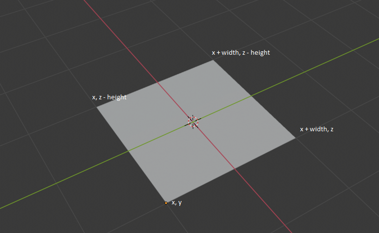
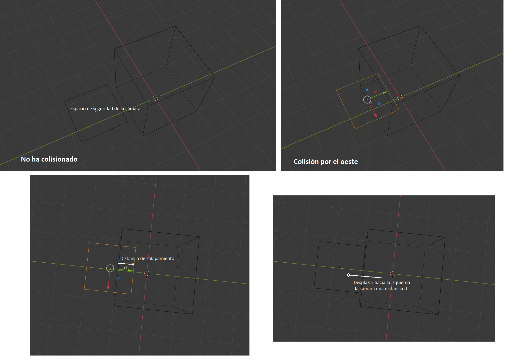

# Iluminación

<center></center>

El objetivo en esta práctica crear un escenario en el que experimentar con la iluminación sobre objetos 3D. La escena elegida ha sido el interior de una casa, donde se representa un salón, un pasillo y un baño. En cada uno de ellos se intenta reproducir una escena de las películas [Babadook](https://www.filmaffinity.com/es/film287094.html), [El Resplandor](https://www.filmaffinity.com/es/film598422.html) y [Psicosis](https://www.filmaffinity.com/es/film363992.html).

La iluminación en cada una de estas escenas se ha aplicado de forma distinta, para así conseguir un efecto distinto.

### Controles

WASD: control de movimiento por la escena.
  Derecha/Izquierda : AD
  Avanza/Retrocede : WS
Mouse: girar cámara.

### Cámara

La simulación de movimiento lo conseguimos utilizando la librería QueasyCam de Processing, con la que obtenemos una cámara en primera persona.

Esta cámara puede ser personalizada sobreescribiendo la clase QueasyCam. Esto nos permitirá obtener la posición de la cámara en cada momento, editarla y establecer las dimensiones del espacio de seguridad de la cámara. Esto nos es útil para mantener al usuario dentro del escenario, controlando colisiones con las paredes.

### Construcción de habitaciones

Para la contrucción de las habitaciones poseemos 3 objetos: las paredes, los techos y los suelos.

Tantos los techos como suelos están representados en la clase Plane, en la que dibujamos un plano creando un PShape a partir de 4 vértices calculados a partir de la posición y dimensiones dadas.

<!-- Imagen plano -->


De igual forma, creamos las paredes, pero en este caso, creando los 6 planos correspondientes a los 6 planos de un ortoedro.

<!-- imagen cubo -->

#### Colisiones

Para evitar que el usuario se salga de la escena, hacemos que no pueda atravesar las paredes. Para ello, cuando detectamos que la cámara ha atravesado alguna de las 4 caras, la desplazamos tanto como se haya introducido.

Para ello, como la cámara no gira sobre si misma, cuando detectamos que una esquina ha entrado por una de las caras del cubo, calculamos la distancia y la desplazamos hacia afuera esa distancia.

<!-- Colisiones -->


### Iluminación

#### Salón

Para la iluminación del salón tenemos una luz ambiente de tonalidad gris, la luz de una lámpara y la luz del televisor.

```java
// Luz ambiente
noLights();
ambientLight(100, 100, 100);
```

```java
// Luz de la lámpara
pointLight(80, 50, 0,
             90, 10, -30);
```

Para imitar la luz del televisor, actualizamos el color de una luz focal aleatoriamente, localizándolo frente a la tele y apuntando hacia el salón. Para conseguir un aspecto más realista, aplicamos un [ruido de perlín](https://es.wikipedia.org/wiki/Ruido_Perlin), para así evitar que los cambios de la luz sean bruscos.

```java
PVector tv_color = new PVector(0, 0.1, 0.2);

tv_color.x += .1;
tv_color.y += .1;
tv_color.z += .1;

spotLight(noise(tv_color.x) * 255, noise(tv_color.y) * 255, noise(tv_color.z) * 255,
          70, -5, -10,
          0, 0, -1,
          PI/2,
          1);
```

#### Pasillo

En el pasillo también se aplica una luz ambiente inicial y, posteriormente, con una luz focal se trata de simular la luz de lámparas que cuelgan por el pasillo.

#### Baño

Finalmente, en el baño, eliminamos por completo la luz ambiente, consiguiendo así un contraste más marcado y un escenario más dramático.

Para simular el reflejo del lavamanos, el báter y el espejo, añadimos un efecto de reflejo sobre los objetos que los representan.

```java
lightSpecular(100,100,100);
spotLight(255,255,255,
          112.5, -17, -100,
          0,0,-1,
          2*PI/8,
          9);
```

### Referencias

- [Perlin noise](https://es.wikipedia.org/wiki/Ruido_Perlin)
- Ficheros obj:
  - [3dsky.org]()
  - [cadnav.com]()
  - [cgtrader.com]()
  - [free3D.com]()
- [Blender](https://www.blender.org/) para la modificación de ciertos modelos 3D.
- [MakeHuman](http://www.makehumancommunity.org/) y [Adobe Fuse](https://www.adobe.com/es/products/fuse.html) para la creación de los modelos humanos.
